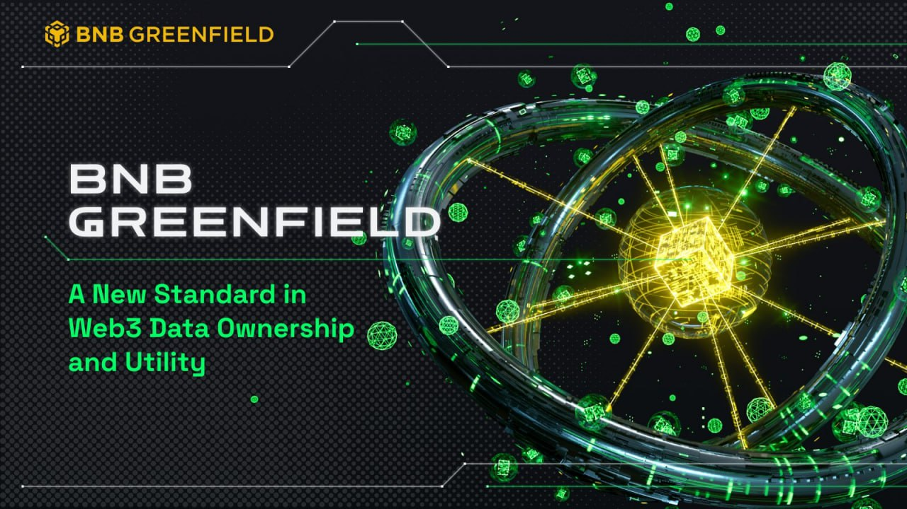

# BNB Greenfield Whitepaper

<figure><figcaption></figcaption></figure>

The goal of the BNB Greenfield is to unleash the power of decentralized blockchain and storage technology on data ownership and data economy.

BNB Greenfield is not only a new blockchain in BNB but also an infrastructure and ecosystem targeting to facilitate the decentralized data economy. It tries to achieve it by easing the process to store and manage data access and linking data ownership with the massive DeFi context of BSC.

It focuses on 3 parts that differ from existing centralized and decentralized storage systems:

* It enables Ethereum-compatible addresses to create and manage both data and token assets.
* It natively links data permissions and management logic onto BSC as exchangeable assets and smart contract programs with all other assets.
* It provides developers with similar API primitives and performance as popular existing Web2 cloud storage.

It is expected that Greenfield will set up a playground and test field for new data economy and dApp models, which eventually becomes part of the foundation for Web3.

The white paper in this repository describes the main design and implementation of the platform. Many ideas are based on the great contributions of other leading protocols and teams. Please refer to the acknowledgment sections.

Any constructive opinions, ideas, and feedback are welcome.

Hope everyone enjoys the journey!

## Table of Content

* [Overview](readme/overview/)
* [Part 1 Design of the BNB Greenfield and the Decentralized Storage Economy](readme/overview/part1.md)
  * [1 Design Principles](readme/overview/part1.md#1-design-principles)
  * [2 Assumptions](readme/overview/part1.md#2-assumptions)
  * [3 The Architecture in General](readme/overview/part1.md#3-the-architecture-in-general)
    * [3.1 Greenfield Core](readme/overview/part1.md#31-greenfield-core)
    * [3.2 BNB Greenfield dApps](readme/overview/part1.md#32-bnb-greenfield-dapps)
    * [3.3 The Cross-Chain with BSC](readme/overview/part1.md#33-the-cross-chain-with-bsc)
    * [3.4 The Trinity](readme/overview/part1.md#34-the-trinity)
  * [4 BNB Greenfield Core](readme/overview/part1.md#4-bnb-greenfield-core)
    * [4.1 The BNB Greenfield Blockchain](readme/overview/part1.md#41-the-bnb-greenfield-blockchain)
    * [4.2 The Storage Providers, SPs](readme/overview/part1.md#42-the-storage-providers-sps)
    * [4.3 The Pair Synergy](readme/overview/part1.md#43-the-pair-synergy)
  * [5 The Greenfield Data Storage](readme/overview/part1.md#5-the-greenfield-data-storage)
    * [5.1 Data with Consensus](readme/overview/part1.md#51-data-with-consensus)
      * [5.1.1 Accounts and Balance](readme/overview/part1.md#511-accounts-and-balance)
      * [5.1.2 Validator and SP Metadata](readme/overview/part1.md#512-validator-and-sp-metadata)
      * [5.1.3 Storage Metadata](readme/overview/part1.md#513-storage-metadata)
      * [5.1.4 Permission Metadata](readme/overview/part1.md#514-permission-metadata)
      * [5.1.5 Billing Metadata](readme/overview/part1.md#515-billing-metadata)
    * [5.2 Off-Chain Payload Object Data Storage](readme/overview/part1.md#52-off-chain-payload-object-data-storage)
      * [5.2.1 Primary and Secondary SPs](readme/overview/part1.md#521-primary-and-secondary-sps)
      * [5.2.2 Data Redundancy](readme/overview/part1.md#522-data-redundancy)
  * [6 Storage Economics and Its Primitives](readme/overview/part1.md#6-storage-economics-and-its-primitives)
    * [6.1 Account Creation](readme/overview/part1.md#61-account-creation)
    * [6.2 Data Object Creation](readme/overview/part1.md#62-data-object-creation)
    * [6.3 Data Storage](readme/overview/part1.md#63-data-storage)
    * [6.4 Data Read and Download](readme/overview/part1.md#64-data-read-and-download)
    * [6.5 Permissions and Group](readme/overview/part1.md#65-permissions-and-group)
    * [6.6 Fees and Payments](readme/overview/part1.md#66-fees-and-payments)
    * [6.7 Data Integrity and Availability Challenge](readme/overview/part1.md#67-data-integrity-and-availability-challenge)
    * [6.8 Data Delete](readme/overview/part1.md#68-data-delete)
  * [7 Economy of Data Assets](readme/overview/part1.md#7-economy-of-data-assets)
    * [7.1 Cross-Chain with BSC](readme/overview/part1.md#71-cross-chain-with-bsc)
    * [7.2 Framework](readme/overview/part1.md#72-framework)
    * [7.3 Communication Layer](readme/overview/part1.md#73-communication-layer)
    * [7.4 Resource Mirror Layer](readme/overview/part1.md#74-resource-mirror-layer)
      * [7.4.1 Resource Entity Mirror](readme/overview/part1.md#741-resource-entity-mirror)
      * [7.4.2 Cross-Chain Operating Primitives](readme/overview/part1.md#742-cross-chain-operating-primitives)
  * [8 "Not" Ending for the Design](readme/overview/part1.md#8-not-ending-for-the-design)
    * [8.1 Acknowledgement](readme/overview/part1.md#81-acknowledgement)
* [Part 2 Showcases in Labs](readme/overview/part2.md)
  * [9 Showcases: Decentralized Storage](readme/overview/part2.md#9-showcases-decentralized-storage)
    * [9.1 Web Hosting and Personal Cloud Drive](readme/overview/part2.md#91-web-hosting-and-personal-cloud-drive)
    * [9.2 Data Availability Layer for Public Blockchain](readme/overview/part2.md#92-data-availability-layer-for-public-blockchain)
      * [9.2.1 Layer 1 Blockchain Data Swapping](readme/overview/part2.md#921-layer-1-blockchain-data-swapping)
      * [9.2.2 Data Availability Layer for the Layer 2 Rollups](readme/overview/part2.md#922-data-availability-layer-for-the-layer-2-rollups)
      * [9.2.3 Snapshots and Block Data Backups](readme/overview/part2.md#923-snapshots-and-block-data-backups)
  * [10 Showcases: New Ways of Digital Publishing](readme/overview/part2.md#10-showcases-new-ways-of-digital-publishing)
    * [10.1 Grass-Root Digital Publishing](readme/overview/part2.md#101-grass-root-digital-publishing)
    * [10.2 Data Market](readme/overview/part2.md#102-data-market)
    * [10.3 Risk: Anti-Piracy](readme/overview/part2.md#103-risk-anti-piracy)
  * [11 Showcases: User-Generated Content](readme/overview/part2.md#11-showcases-user-generated-content)
    * [11.1 Anti-Monopoly and Anti-Censorship](readme/overview/part2.md#111-anti-monopoly-and-anti-censorship)
    * [11.2 Token Curated Registries](readme/overview/part2.md#112-token-curated-registries)
  * [12 Showcases: Personal Data Market](readme/overview/part2.md#12-showcases-personal-data-market)
  * [13 From Showcases to Real Production](readme/overview/part2.md#13-from-showcases-to-real-production)
* [Part 3 Simplified Technical Specifications](readme/overview/part3.md)
  * [14 Ecosystem Players](readme/overview/part3.md#14-ecosystem-players)
    * [14.1 Greenfield Validators](readme/overview/part3.md#141-greenfield-validators)
    * [14.2 Storage Providers (SPs)](readme/overview/part3.md#142-storage-providers-sps)
    * [14.3 Greenfield dApps](readme/overview/part3.md#143-greenfield-dapps)
  * [15 User Identifier](readme/overview/part3.md#15-user-identifier)
    * [15.1 User Balance](readme/overview/part3.md#151-user-balance)
  * [16 Greenfield Blockchain](readme/overview/part3.md#16-greenfield-blockchain)
    * [16.1 Token Economics](readme/overview/part3.md#161-token-economics)
    * [16.2 Consensus and Validator Election](readme/overview/part3.md#162-consensus-and-validator-election)
    * [16.3 Governance Transactions](readme/overview/part3.md#163-governance-transactions)
      * [16.3.1 Create and Edit Validator](readme/overview/part3.md#1631-create-and-edit-validator)
      * [16.3.2 Staking Reward Distribution](readme/overview/part3.md#1632-staking-reward-distributio-n)
      * [16.3.3 Create Storage Provider](readme/overview/part3.md#1633-create-storage-provider)
      * [16.3.4 Remove Storage Provider](readme/overview/part3.md#1634-remove-storage-provider)
  * [17 Storage MetaData Models](readme/overview/part3.md#17-storage-metadata-models)
    * [17.1 Bucket](readme/overview/part3.md#171-bucket)
    * [17.2 Object](readme/overview/part3.md#172-object)
    * [17.3 Group](readme/overview/part3.md#173-group)
    * [17.4 Permission](readme/overview/part3.md#174-permission)
      * [17.4.1 Ownership](readme/overview/part3.md#1741-ownership)
      * [17.4.2 Permission Definitions](readme/overview/part3.md#1742-permission-definitions)
      * [17.4.3 Permission Removal](readme/overview/part3.md#1743-permission-removal)
      * [17.4.4 Examples](readme/overview/part3.md#1744-examples)
  * [18 Payload Storage Management](readme/overview/part3.md#18-payload-storage-management)
    * [18.1 Segments](readme/overview/part3.md#181-segments)
    * [18.2 Erasure Code and Data Redundancy](readme/overview/part3.md#182-erasure-code-and-data-redundancy)
      * [18.2.1 Data Redundancy Design](readme/overview/part3.md#1821-data-redundancy-design)
      * [18.2.2 Erasure Code](readme/overview/part3.md#1822-erasure-code)
        * [18.2.2.1 Encoding](readme/overview/part3.md#18221-encoding)
        * [18.2.2.2 Decoding: Data Recovery](readme/overview/part3.md#18222-decoding-data-recovery)
  * [19 Data Availability Challenge](readme/overview/part3.md#19-data-availability-challenge)
    * [19.1 The Initial Data Integrity and Redundancy Metadata](readme/overview/part3.md#191-the-initial-data-integrity-and-redundancy-metadata)
    * [19.2 Data Availability Challenge Process](readme/overview/part3.md#192-data-availability-challenge-process)
  * [20 Storage Transactions](readme/overview/part3.md#20-storage-transactions)
  * [21 Billing and Payment](readme/overview/part3.md#21-billing-and-payment)
    * [21.1 Concepts and Formulas](readme/overview/part3.md#211-concepts-and-formulas)
      * [21.1.1 Terminology](readme/overview/part3.md#2111-terminology)
      * [21.1.2 Formula](readme/overview/part3.md#2112-formula)
      * [21.1.3 Types and Interfaces](readme/overview/part3.md#2113-types-and-interfaces)
    * [21.2 Key Workflow](readme/overview/part3.md#212-key-workflow)
      * [21.2.1 Deposit and Withdrawal](readme/overview/part3.md#2121-deposit-and-withdrawal)
      * [21.2.2 Payment Stream](readme/overview/part3.md#2122-payment-stream)
      * [21.2.3 Forced Settlement](readme/overview/part3.md#2123-forced-settlement)
      * [21.2.4 Payment Account](readme/overview/part3.md#2124-payment-account)
      * [21.2.5 Account Freeze and Resume](readme/overview/part3.md#2125-account-freeze-and-resume)
      * [21.2.6 Storage Fee Price and Adjustment](readme/overview/part3.md#2126-storage-fee-price-and-adjustment)
  * [22 Cross-Chain Models](readme/overview/part3.md#22-cross-chain-models)
    * [22.1 Communication Channels and Packages](readme/overview/part3.md#221-communication-channels-and-packages)
      * [22.1.1 Vote Poll](readme/overview/part3.md#2211-vote-poll)
      * [22.1.2 Channel and Sequence](readme/overview/part3.md#2212-channel-and-sequence)
      * [22.1.3 Reliability Protocol](readme/overview/part3.md#2213-reliability-protocol)
      * [22.1.4 Validator Update](readme/overview/part3.md#2214-validator-update)
    * [22.2 Economic](readme/overview/part3.md#22-2-economic)
      * [22.2.1 Fee and Reward of Cross-Chain Packages](readme/overview/part3.md#2221-fee-and-reward-of-cross-chain-packages)
      * [22.2.2 Race to Deliver Cross-Chain Packages](readme/overview/part3.md#2222-race-to-deliver-cross-chain-packages)
      * [22.2.3 Callbacks and Limited Gas](readme/overview/part3.md#2223-callbacks-and-limited-gas)
      * [22.2.4 Cross-Chain Infrastructure Contracts on BSC](readme/overview/part3.md#2224-cross-chain-infrastructure-contracts-on-bsc)
    * [22.3 Error and Failure Handling](readme/overview/part3.md#223-error-and-failure-handling)
  * [23 SP APIs](readme/overview/part3.md#23-sp-apis)
    * [23.1 Universal Endpoint](readme/overview/part3.md#231-universal-endpoint)
      * [23.1.1 URI Standard](readme/overview/part3.md#2311-uri-standard)
      * [23.1.2 HTTPS REST API](readme/overview/part3.md#2312-https-rest-api)
      * [23.1.3 P2P RPC](readme/overview/part3.md#2313-p2p-rpc)
    * [23.2 List Operations](readme/overview/part3.md#232-list-operations)
* [Ending](readme/ending.md)

## License

All the content are licensed under [CC BY 4.0](https://creativecommons.org/licenses/by/4.0/).
